# Excel Medical Staffing - Data Flow Diagram

```mermaid
flowchart TD
    %% External Data Sources
    LaborEdge[LaborEdge ATS/VMS API]
    EmailProvider[Email Service Provider]
    SMSProvider[SMS Provider]
    SocialMedia[Social Media Platforms]
    PaymentGateway[Payment Gateway]
    
    %% User Interfaces
    WebUI[Web Interface]
    MobileUI[Mobile Interface]
    RecruiterUI[Recruiter Portal]
    AdminUI[Admin Dashboard]
    
    %% Core Services
    JobService[Job Service]
    CandidateService[Candidate Service]
    RecruiterService[Recruiter Service]
    ReferralService[Referral Service]
    ContentService[Content Service]
    NotificationService[Notification Service]
    AnalyticsService[Analytics Service]
    ComplianceService[Compliance Service]
    
    %% AI Components
    ConversationalAI[Conversational AI]
    ResumeParser[Resume Parser]
    JobMatcher[Job Matching Engine]
    ContentGenerator[Content Generator]
    JourneyAnalyzer[Candidate Journey Analyzer]
    InsightsEngine[Insights Engine]
    
    %% Data Stores
    JobsDB[(Jobs Database)]
    CandidatesDB[(Candidates Database)]
    RecruitersDB[(Recruiters Database)]
    ReferralsDB[(Referrals Database)]
    ContentDB[(Content Database)]
    AnalyticsDB[(Analytics Database)]
    SearchIndex[(Search Index)]
    Cache[(Cache Layer)]
    
    %% Job Data Flow
    LaborEdge -->|1. Pull job data| JobService
    JobService -->|2. Store job data| JobsDB
    JobService -->|3. Index jobs| SearchIndex
    JobService -->|4. Cache popular jobs| Cache
    ContentGenerator -->|5. Generate job descriptions| JobService
    
    %% Candidate Data Flow
    WebUI -->|1. Submit application| CandidateService
    MobileUI -->|1. Submit application| CandidateService
    ResumeParser -->|2. Parse resume| CandidateService
    CandidateService -->|3. Store candidate data| CandidatesDB
    CandidateService -->|4. Index candidate profiles| SearchIndex
    JobMatcher -->|5. Match candidates to jobs| CandidateService
    CandidateService -->|6. Send application to LaborEdge| LaborEdge
    JourneyAnalyzer -->|7. Track candidate journey| CandidateService
    CandidateService -->|8. Trigger notifications| NotificationService
    
    %% Recruiter Data Flow
    RecruiterUI -->|1. Access dashboard| RecruiterService
    RecruiterService -->|2. Fetch recruiter data| RecruitersDB
    RecruiterService -->|3. Generate shareable links| RecruiterService
    RecruiterService -->|4. Track attribution| AnalyticsService
    InsightsEngine -->|5. Generate recommendations| RecruiterService
    RecruiterService -->|6. Update recruiter metrics| RecruitersDB
    
    %% Referral Data Flow
    WebUI -->|1. Submit referral| ReferralService
    MobileUI -->|1. Submit referral| ReferralService
    ReferralService -->|2. Store referral data| ReferralsDB
    ReferralService -->|3. Track referral status| ReferralsDB
    ReferralService -->|4. Process referral payments| PaymentGateway
    ReferralService -->|5. Trigger notifications| NotificationService
    
    %% Content Data Flow
    ContentGenerator -->|1. Generate content| ContentService
    ContentService -->|2. Store content| ContentDB
    ContentService -->|3. Publish to website| WebUI
    ContentService -->|4. Distribute via social| SocialMedia
    ContentService -->|5. Track engagement| AnalyticsService
    
    %% Notification Data Flow
    NotificationService -->|1. Send emails| EmailProvider
    NotificationService -->|2. Send SMS| SMSProvider
    NotificationService -->|3. Send in-app notifications| WebUI
    NotificationService -->|3. Send in-app notifications| MobileUI
    NotificationService -->|3. Send in-app notifications| RecruiterUI
    
    %% Analytics Data Flow
    WebUI -->|1. Track user behavior| AnalyticsService
    MobileUI -->|1. Track user behavior| AnalyticsService
    RecruiterUI -->|1. Track user behavior| AnalyticsService
    AnalyticsService -->|2. Store analytics data| AnalyticsDB
    InsightsEngine -->|3. Generate insights| AnalyticsService
    AnalyticsService -->|4. Display dashboards| AdminUI
    AnalyticsService -->|4. Display dashboards| RecruiterUI
    
    %% Compliance Data Flow
    ComplianceService -->|1. Verify licenses| CandidateService
    ComplianceService -->|2. Track compliance status| CandidatesDB
    ComplianceService -->|3. Generate compliance reports| AdminUI
    
    %% Conversational AI Flow
    WebUI -->|1. User queries| ConversationalAI
    MobileUI -->|1. User queries| ConversationalAI
    ConversationalAI -->|2. Access job data| JobsDB
    ConversationalAI -->|2. Access candidate data| CandidatesDB
    ConversationalAI -->|3. Provide responses| WebUI
    ConversationalAI -->|3. Provide responses| MobileUI
```

## Data Flow Descriptions

### 1. Job Data Flow

1. **Data Acquisition**:
   - System pulls job data from LaborEdge ATS/VMS API on a scheduled basis
   - New jobs and updates are identified and processed

2. **Data Processing**:
   - Job Service processes and normalizes the job data
   - AI Content Generator enhances job descriptions with SEO-optimized content
   - Schema markup is added for search engine optimization

3. **Data Storage**:
   - Processed jobs are stored in the Jobs Database (PostgreSQL)
   - Jobs are indexed in Elasticsearch for fast searching
   - Popular jobs are cached in Redis for performance

4. **Data Distribution**:
   - Jobs are displayed on the website and mobile app
   - Jobs are shared through social media and email campaigns
   - Jobs are made available to the Job Matching Engine

5. **Data Analytics**:
   - Job views, clicks, and applications are tracked
   - Job performance metrics are calculated
   - Insights are generated for recruiters and administrators

### 2. Candidate Data Flow

1. **Data Collection**:
   - Candidates submit applications through web or mobile interfaces
   - Resumes are uploaded and processed by the Resume Parser
   - AI extracts structured data from resumes

2. **Profile Creation**:
   - Candidate profiles are created or updated in the Candidates Database
   - Profiles are indexed in Elasticsearch for searching
   - Candidate preferences and skills are identified

3. **Job Matching**:
   - Job Matching Engine matches candidates to relevant jobs
   - Match scores are calculated based on skills, experience, and preferences
   - Matches are stored and updated as new jobs become available

4. **Application Processing**:
   - Applications are submitted to LaborEdge ATS/VMS
   - Application status is tracked and updated
   - Candidate Journey Analyzer tracks the application process

5. **Communication**:
   - Notification Service sends updates to candidates
   - Automated nudges are sent based on candidate behavior
   - Personalized job recommendations are delivered

6. **Compliance**:
   - Compliance Service verifies licenses and credentials
   - Compliance status is tracked and updated
   - Compliance reports are generated for administrators

### 3. Recruiter Data Flow

1. **Dashboard Access**:
   - Recruiters access their personalized dashboard
   - Dashboard displays assigned candidates, jobs, and performance metrics

2. **Job Sharing**:
   - Recruiters create shareable job links with attribution
   - Links are tracked for views, applications, and placements
   - Attribution is maintained throughout the candidate journey

3. **Candidate Management**:
   - Recruiters view and manage assigned candidates
   - Recruiters update candidate status and notes
   - Recruiters receive notifications about candidate activities

4. **Performance Tracking**:
   - Recruiter activities and outcomes are tracked
   - Performance metrics are calculated and displayed
   - Insights Engine generates recommendations for improvement

5. **Communication**:
   - Recruiters send personalized messages to candidates
   - Communication history is tracked and stored
   - Templates and automated messages are available

### 4. Referral Data Flow

1. **Referral Submission**:
   - Users submit referrals through web or mobile interfaces
   - Referral information is validated and processed
   - Referral codes and tracking links are generated

2. **Referral Tracking**:
   - Referral status is tracked throughout the recruitment process
   - Referrers are notified of status changes
   - Attribution is maintained for proper credit

3. **Referral Conversion**:
   - When referrals are placed, conversion is recorded
   - Bonus eligibility is determined based on placement terms
   - Payment processing is initiated for eligible bonuses

4. **Payment Processing**:
   - Referral payments are processed through Payment Gateway
   - Payment status is tracked and updated
   - Payment history is maintained for reporting

5. **Analytics**:
   - Referral program performance is tracked and analyzed
   - Conversion rates and ROI are calculated
   - Insights are generated for program optimization

### 5. Content Data Flow

1. **Content Generation**:
   - AI Content Generator creates blog posts, city guides, and job descriptions
   - Content is optimized for SEO and engagement
   - Content is stored in the Content Database

2. **Content Review**:
   - Generated content is reviewed by administrators
   - Content is edited and approved for publication
   - Content metadata and tags are added

3. **Content Publication**:
   - Approved content is published to the website
   - Content is distributed through social media and email campaigns
   - Content is made available to the search index

4. **Content Engagement**:
   - Content views, shares, and engagement are tracked
   - Content performance metrics are calculated
   - Insights are generated for content optimization

5. **Content Personalization**:
   - Content recommendations are personalized for users
   - Related content is suggested based on user behavior
   - Content is dynamically displayed based on user context

### 6. Analytics Data Flow

1. **Data Collection**:
   - User behavior is tracked across all interfaces
   - Events are captured and processed in real-time
   - Data is validated and normalized

2. **Data Storage**:
   - Processed data is stored in the Analytics Database
   - Historical data is maintained for trend analysis
   - Data is aggregated for reporting

3. **Data Analysis**:
   - Insights Engine analyzes data for patterns and trends
   - Performance metrics are calculated
   - Predictive models are generated

4. **Data Visualization**:
   - Dashboards display key metrics and insights
   - Reports are generated for stakeholders
   - Alerts are triggered for anomalies or opportunities

5. **Data-Driven Actions**:
   - Insights drive automated actions and recommendations
   - A/B testing is conducted for optimization
   - System behavior adapts based on analytics