# Excel Medical Staffing - Technical Architecture Diagram

```mermaid
graph TD
    %% Client Layer
    subgraph "Client Layer"
        A1[Web Browser]
        A2[Mobile Browser]
    end

    %% Presentation Layer
    subgraph "Presentation Layer"
        B1[React Frontend]
        B2[Progressive Web App]
        B3[Admin Dashboard]
        B4[Recruiter Portal]
    end

    %% API Gateway
    subgraph "API Gateway"
        C1[API Gateway / Load Balancer]
        C2[Authentication Service]
        C3[Rate Limiting]
        C4[Request Routing]
    end

    %% Microservices
    subgraph "Microservices"
        D1[Job Service]
        D2[Candidate Service]
        D3[Recruiter Service]
        D4[Referral Service]
        D5[Content Service]
        D6[Notification Service]
        D7[Analytics Service]
        D8[Compliance Service]
    end

    %% AI Components
    subgraph "AI Components"
        E1[Conversational AI]
        E2[Resume Parser]
        E3[Job Matching Engine]
        E4[Content Generator]
        E5[Candidate Journey Analyzer]
        E6[Insights Engine]
    end

    %% Data Layer
    subgraph "Data Layer"
        F1[(PostgreSQL)]
        F2[(MongoDB)]
        F3[(Elasticsearch)]
        F4[(Redis Cache)]
        F5[(Data Warehouse)]
    end

    %% Integration Layer
    subgraph "Integration Layer"
        G1[LaborEdge API Client]
        G2[Email Service]
        G3[SMS Gateway]
        G4[Social Media API]
        G5[Payment Processing]
        G6[Analytics Integration]
    end

    %% Infrastructure
    subgraph "Infrastructure"
        H1[AWS ECS/Kubernetes]
        H2[AWS S3]
        H3[CloudFront CDN]
        H4[AWS Lambda]
        H5[AWS CloudWatch]
    end

    %% External Systems
    subgraph "External Systems"
        I1[LaborEdge ATS/VMS]
        I2[Email Provider]
        I3[SMS Provider]
        I4[Social Media Platforms]
        I5[Payment Gateway]
        I6[Analytics Platforms]
    end

    %% Connections
    A1 --> B1
    A2 --> B2
    B1 --> C1
    B2 --> C1
    B3 --> C1
    B4 --> C1
    
    C1 --> C2
    C1 --> C3
    C1 --> C4
    
    C4 --> D1
    C4 --> D2
    C4 --> D3
    C4 --> D4
    C4 --> D5
    C4 --> D6
    C4 --> D7
    C4 --> D8
    
    D1 --> E3
    D2 --> E2
    D2 --> E3
    D2 --> E5
    D5 --> E4
    D7 --> E6
    
    D1 --> F1
    D2 --> F1
    D3 --> F1
    D4 --> F1
    D5 --> F2
    D6 --> F1
    D7 --> F5
    D8 --> F1
    
    D1 --> F3
    D2 --> F3
    
    D1 --> F4
    D2 --> F4
    D3 --> F4
    D4 --> F4
    
    D1 --> G1
    D2 --> G1
    D6 --> G2
    D6 --> G3
    D5 --> G4
    D4 --> G5
    D7 --> G6
    
    G1 --> I1
    G2 --> I2
    G3 --> I3
    G4 --> I4
    G5 --> I5
    G6 --> I6
    
    E1 --> B1
    E1 --> B2
    
    H1 --> D1
    H1 --> D2
    H1 --> D3
    H1 --> D4
    H1 --> D5
    H1 --> D6
    H1 --> D7
    H1 --> D8
    
    H2 --> B1
    H2 --> B2
    H2 --> D5
    
    H3 --> B1
    H3 --> B2
    
    H4 --> E1
    H4 --> E2
    H4 --> E3
    H4 --> E4
    H4 --> E5
    H4 --> E6
    
    H5 --> H1
    H5 --> H4
```

## Component Descriptions

### Client Layer
- **Web Browser**: Standard web browsers accessing the platform
- **Mobile Browser**: Mobile-optimized access to the platform

### Presentation Layer
- **React Frontend**: Main web application built with React.js
- **Progressive Web App**: Mobile-optimized version with offline capabilities
- **Admin Dashboard**: Administrative interface for system management
- **Recruiter Portal**: Specialized interface for recruiters

### API Gateway
- **API Gateway / Load Balancer**: Entry point for all client requests
- **Authentication Service**: Handles user authentication and authorization
- **Rate Limiting**: Prevents abuse and ensures fair resource allocation
- **Request Routing**: Directs requests to appropriate microservices

### Microservices
- **Job Service**: Manages job listings, search, and recommendations
- **Candidate Service**: Handles candidate profiles, applications, and matching
- **Recruiter Service**: Manages recruiter profiles and attribution
- **Referral Service**: Handles referral tracking and rewards
- **Content Service**: Manages blog posts, city guides, and other content
- **Notification Service**: Handles email, SMS, and in-app notifications
- **Analytics Service**: Collects and processes user behavior data
- **Compliance Service**: Manages license verification and compliance workflows

### AI Components
- **Conversational AI**: Handles chat and voice interactions
- **Resume Parser**: Extracts structured data from resumes
- **Job Matching Engine**: Matches candidates to jobs based on skills and preferences
- **Content Generator**: Creates blog posts, city guides, and job descriptions
- **Candidate Journey Analyzer**: Tracks and optimizes candidate experience
- **Insights Engine**: Generates recommendations for recruiters and candidates

### Data Layer
- **PostgreSQL**: Primary relational database for structured data
- **MongoDB**: Document store for unstructured data (resumes, job descriptions)
- **Elasticsearch**: Search engine for job and candidate search
- **Redis Cache**: In-memory cache for performance optimization
- **Data Warehouse**: For analytics and reporting

### Integration Layer
- **LaborEdge API Client**: Connects to LaborEdge ATS/VMS
- **Email Service**: Integrates with email providers
- **SMS Gateway**: Integrates with SMS providers
- **Social Media API**: Connects to social media platforms
- **Payment Processing**: Handles referral payments
- **Analytics Integration**: Connects to analytics platforms

### Infrastructure
- **AWS ECS/Kubernetes**: Container orchestration for microservices
- **AWS S3**: Object storage for files and static assets
- **CloudFront CDN**: Content delivery network for static assets
- **AWS Lambda**: Serverless functions for AI components
- **AWS CloudWatch**: Monitoring and logging

### External Systems
- **LaborEdge ATS/VMS**: External ATS/VMS system
- **Email Provider**: External email service provider
- **SMS Provider**: External SMS service provider
- **Social Media Platforms**: External social media platforms
- **Payment Gateway**: External payment processing service
- **Analytics Platforms**: External analytics services

## Data Flow

1. **Job Data Flow**:
   - Jobs are pulled from LaborEdge API via scheduled jobs
   - Jobs are processed, enhanced with AI-generated content, and stored in PostgreSQL
   - Jobs are indexed in Elasticsearch for fast searching
   - Jobs are displayed on the website with proper schema markup
   - Job applications are processed and stored in the candidate service
   - Application attribution is tracked for recruiters and referrals

2. **Candidate Data Flow**:
   - Candidates register or apply for jobs
   - Resumes are parsed by the AI resume parser
   - Candidate profiles are created/updated in PostgreSQL
   - Job matching algorithm suggests relevant jobs
   - Candidate journey is tracked through the application process
   - Automated nudges are sent based on candidate behavior
   - Compliance workflows verify licenses and credentials

3. **Recruiter Data Flow**:
   - Recruiters access the recruiter portal
   - They can view assigned candidates and jobs
   - They can create shareable job links with attribution
   - They receive notifications about candidate applications
   - They can track their performance metrics
   - They can access insights and recommendations

4. **Referral Data Flow**:
   - Users submit referrals through the referral form
   - Referral service tracks the referral through the recruitment process
   - Notifications are sent to referrers about their referral's status
   - Payments are processed when referrals are successfully placed
   - Analytics track referral conversion rates and performance

5. **Content Data Flow**:
   - AI content generator creates blog posts, city guides, and job descriptions
   - Content is reviewed and published through the CMS
   - Content is optimized for SEO
   - Content is distributed through email and social media
   - Content engagement is tracked for optimization